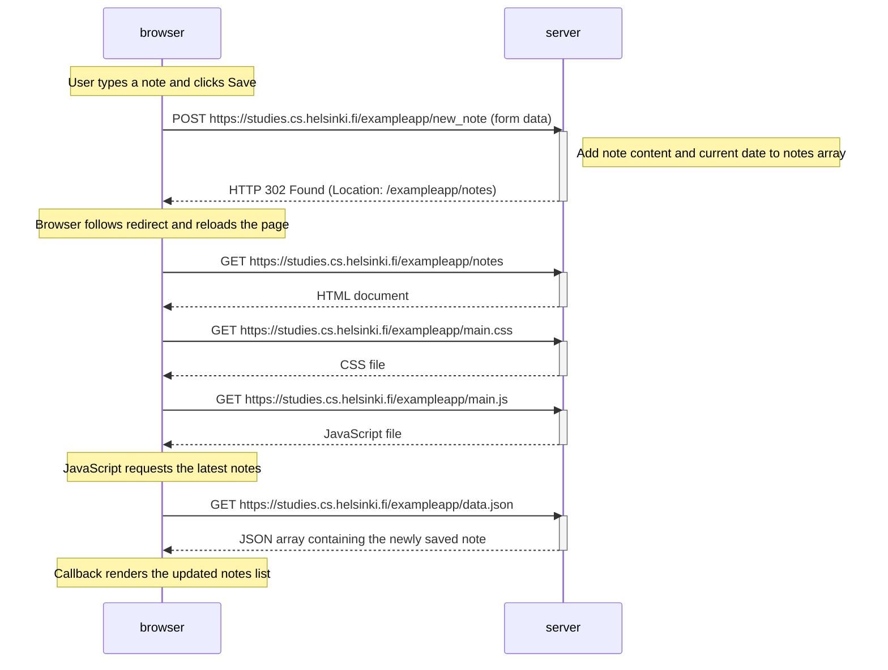

# Exercise 0.4 — New note (traditional notes page)

```mermaid
sequenceDiagram
    participant browser
    participant server

    Note over browser: User types a note and clicks Save
    browser->>server: POST https://studies.cs.helsinki.fi/exampleapp/new_note (form data)
    activate server
    Note right of server: Add note content and current date to notes array
    server-->>browser: HTTP 302 Found (Location: /exampleapp/notes)
    deactivate server

    Note over browser: Browser follows redirect and reloads the page
    browser->>server: GET https://studies.cs.helsinki.fi/exampleapp/notes
    activate server
    server-->>browser: HTML document
    deactivate server

    browser->>server: GET https://studies.cs.helsinki.fi/exampleapp/main.css
    activate server
    server-->>browser: CSS file
    deactivate server

    browser->>server: GET https://studies.cs.helsinki.fi/exampleapp/main.js
    activate server
    server-->>browser: JavaScript file
    deactivate server

    Note over browser: JavaScript requests the latest notes
    browser->>server: GET https://studies.cs.helsinki.fi/exampleapp/data.json
    activate server
    server-->>browser: JSON array containing the newly saved note
    deactivate server

    Note over browser: Callback renders the updated notes list
```
