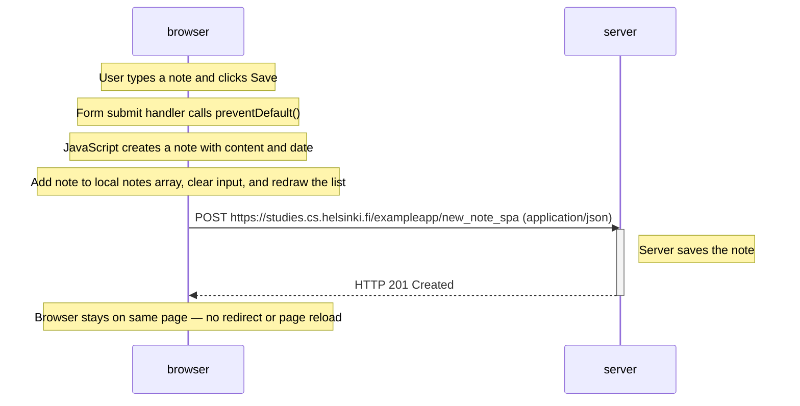

# Exercise 0.6 — Create a new note in the single-page app

```mermaid
sequenceDiagram
    participant browser
    participant server

    Note over browser: User types a note and clicks Save
    Note over browser: Form submit handler calls preventDefault()
    Note over browser: JavaScript creates a note with content and date
    Note over browser: Add note to local notes array, clear input, and redraw the list

    browser->>server: POST https://studies.cs.helsinki.fi/exampleapp/new_note_spa (application/json)
    activate server
    Note right of server: Server saves the note
    server-->>browser: HTTP 201 Created
    deactivate server

    Note over browser: Browser stays on same page — no redirect or page reload
```
